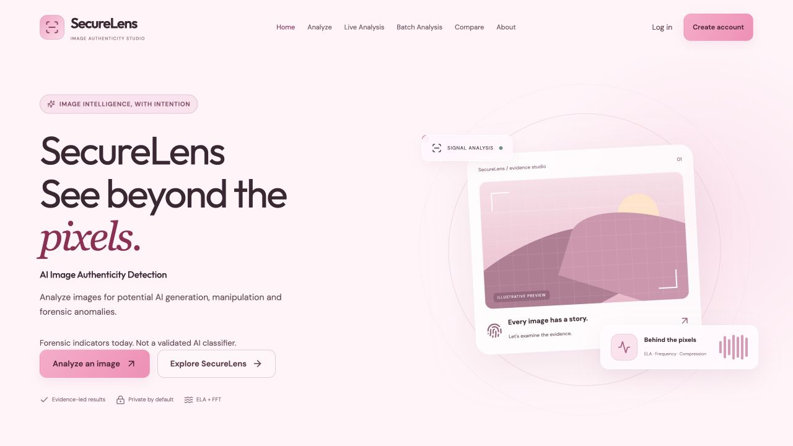
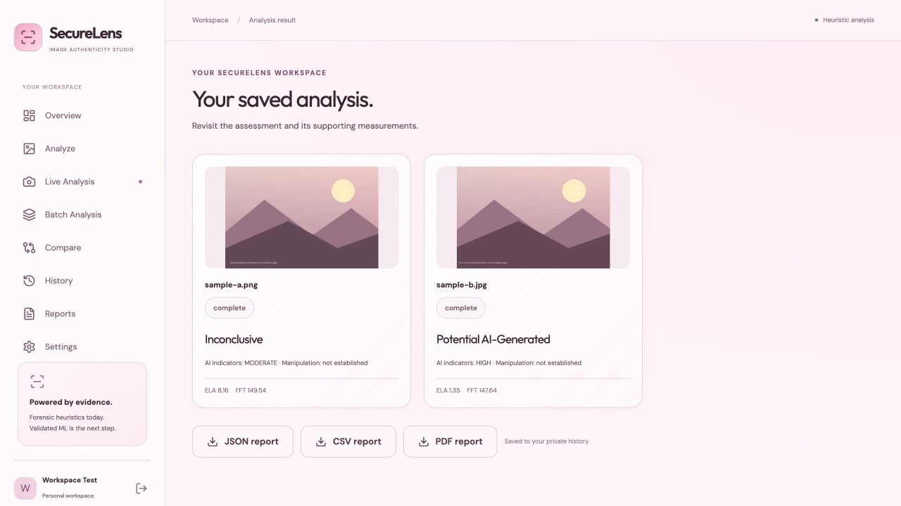

# SecureLens

## AI Image Authenticity & Manipulation Detection

A soft-pink, evidence-led image analysis workspace. Upload an image, examine a
live frame, analyze a batch, or compare two images, then review an authenticity
assessment before exploring the ELA, FFT, compression and pixel evidence behind
it. Accounts provide private saved history and downloadable reports.



**Primary application: React + Vite + Tailwind CSS, FastAPI, PostgreSQL.**
Streamlit is retained for research; Django and ML experiments are preserved,
not competing production backends.

> Results currently use unvalidated forensic heuristics, not a validated
> AI-vs-real classifier. No AI confidence percentages are fabricated. ELA and FFT
> cannot prove AI generation, manipulation or authenticity.

## Features

- Responsive landing page, application sidebar and sophisticated soft-pink theme
- Registration, login, logout, profile settings and cookie preferences
- JPG/JPEG/PNG uploads, preview and prominent authenticity result
- Original image, ELA evidence, FFT spectrum and expandable technical values
- Measured brightness, deviation, entropy, edge density, metadata and compression
- Live webcam analysis with start/stop, session-only frames and optional saving
- Capture multiple live frames into a batch without saving automatically
- Up to 10 images per batch, per-item progress, partial failures and a result grid
- Side-by-side forensic comparison and measured visual similarity
- Private, paginated history with reopen, JSON/PDF downloads and deletion
- CSV export for saved or session-only batches; JSON export for all results
- Optional preview retention, seven days by default, with automatic periodic cleanup
- Vercel frontend routing/API proxy and a separate Render FastAPI deployment template
- Skeletons, error/empty states, notifications and reduced-motion support



[Analysis screen](docs/screenshots/analysis.jpg) / [Mobile preview](docs/screenshots/deployment-mobile.png)

## Architecture

```text
Browser: React + Vite + Tailwind CSS
  | cookie-authenticated /api requests
FastAPI: validation, authentication, analysis, history, reports
  |                    |                    |
SQLAlchemy          Storage interface     Existing src/ engine
  |                    |                    |
PostgreSQL          Private local files   ELA + FFT + statistics
                       |                 + JPEG recompression
                    Cloud adapter later  + future validated ML
```

The domain tables are `users`, `analyses`, `user_preferences` and
`cookie_consents`. Batch items/comparisons are structured JSON within an
analysis record instead of a separate queue/job system. Alembic manages schema
changes. The database is not automatically recreated on API startup.

## Quick Start

Requires Python 3.12+ and Node.js 22.12+ (24 recommended), plus npm or pnpm.
The helper can also use an installed Codex-bundled Node/pnpm runtime locally.

From the repository directory:

```bash
python3 tools/dev.py --setup
```

This installs local dependencies, generates ignored development credentials,
starts private portable PostgreSQL when needed, applies migrations and starts
FastAPI and React. It never deploys or pushes code.

Later launches:

```bash
python3 tools/dev.py
```

Open [SecureLens](http://127.0.0.1:5173) and
[API documentation](http://127.0.0.1:8000/docs). Ctrl+C stops services started by
the helper; an already-running database is left alone.

If the original Django server is already using port 8000:

```bash
python3 tools/dev.py --api-port 8001
```

The frontend remains on 5173 and its API proxy targets 8001. Stop an existing
React server before relaunching it. The new app requires a new account; existing
Django users/data are not silently migrated or erased.

If the helper says the ports are already in use, first open the website above:
it may already be running. Do not double-click `frontend/index.html`; React
needs the Vite server. `--api-port` does not change frontend port 5173.

## Manual Setup

### Backend Environment

```bash
cd backend
python3 -m venv .venv
source .venv/bin/activate
python -m pip install -r requirements-dev.txt
python scripts/setup_local.py
```

`setup_local.py` creates `backend/.env` once with generated random local
passwords and a JWT secret. It preserves an existing file. Use `.env.example`
as the configuration reference, not as real credentials.

### PostgreSQL

Choose one local database option, not both on the same port.

Portable PostgreSQL, in a separate terminal:

```bash
cd tools/local-postgres
npm install
npm start
```

Alternatively, from the repository root with Docker installed:

```bash
docker compose --env-file backend/.env up -d db
```

Both use `127.0.0.1:55432` and the generated local credentials. For an existing
PostgreSQL service, set `DATABASE_URL` to its SQLAlchemy psycopg URL and create
the database before migrating. Do not use portable PostgreSQL in production.

Then, from `backend/` with its environment activated:

```bash
python -m alembic upgrade head
python -m uvicorn app.main:app --reload --host 127.0.0.1 --port 8000
```

### Frontend

In another terminal:

```bash
cd frontend
npm install
npm run dev
```

The default Vite proxy forwards `/api` to `http://127.0.0.1:8000`. See
`frontend/.env.example`; optional overrides belong in ignored `.env.local`:

```dotenv
VITE_PROXY_TARGET=http://127.0.0.1:8001
```

`VITE_API_BASE_URL` selects the public API origin. On Vercel, pair it with
`VITE_API_PROXY=true` to keep authenticated browser requests under the same
origin through the external API rewrite. Locally leave both as in the example.
Frontend variables are public; never put passwords, JWT secrets or private keys
there. See the [deployment guide](docs/deployment.md) before setting up hosts.

## Environment Variables

| Backend variable | Purpose |
| --- | --- |
| `ENVIRONMENT` | `development`, `test` or `production`; production safety checks |
| `DATABASE_URL` | PostgreSQL SQLAlchemy psycopg connection string |
| `JWT_SECRET` | Random signing secret, at least 32 characters |
| `LOCAL_POSTGRES_PASSWORD` | Local portable/Docker database password only |
| `FRONTEND_ORIGINS` | JSON array or comma-separated exact origins; `[]` for backend-first production deployment |
| `COOKIE_SECURE` | False on local HTTP; true with production HTTPS |
| `COOKIE_SAMESITE` | `lax` recommended with proxy/same-site hosts; `none` requires Secure |
| `TRUSTED_HOSTS` | Non-empty JSON array or comma-separated exact API/proxy hostnames; no schemes, paths or wildcards |
| `SESSION_MINUTES` | Cookie/JWT lifetime, default 120 minutes |
| `STORAGE_ROOT` | Private local storage, default backend/.local/storage |
| `IMAGE_RETENTION_DAYS` | Preview lifetime, default 7 days |
| `AUTH_RATE_LIMIT` | Per-process sign-in/register attempts per IP/minute, 20 |
| `STORAGE_CLEANUP_INTERVAL_SECONDS` | Background preview cleanup interval, default 3600 |

Vercel: `VITE_API_BASE_URL=https://your-api.onrender.com` and
`VITE_API_PROXY=true`. `VITE_PROXY_TARGET` is development-only. Use your real
API hostname, not the example. Exact provider settings are in the deployment guide.

## Data, Privacy And Security

New accounts, password hashes, saved metrics, preferences and consent are in
PostgreSQL. Portable database files live in `backend/.local/postgres/`; Docker
uses its named volume. Old Django `db.sqlite3` remains separate and untouched.

Reports are private JSON files under `backend/.local/storage/reports/`.
Images are not retained by default. Explicit retention saves downscaled
original/ELA/FFT previews under `backend/.local/storage/images/`, not the
original full-resolution upload. Previews expire after the configured window;
metrics and reports remain until their analysis is deleted. Every record,
image and report request checks the signed-in owner. Upload parsing can use
temporary disk buffering for large files; those files are closed after processing.

Cleanup runs at API startup, periodically while it runs (hourly by default), and
when an owner reads history/details/previews. It resumes on startup after downtime;
it is not a guaranteed deletion timer when the service is stopped. Manual cleanup:

```bash
cd backend
python scripts/cleanup_storage.py
```

Passwords use Argon2. JWTs live in an HttpOnly, configurable SameSite cookie, not browser
local storage. CSRF tokens protect authenticated writes; CORS and Origin checks
restrict cross-site requests. Logout revokes existing sessions for that account.

Upload checks include extension, MIME and decoded format. Limits are 16 MB per
image, 40 megapixels, 10 images per batch and 64 MB per request. Filenames are
sanitized and UUID storage keys prevent collisions/path traversal.

Cookie choices are stored locally and synced to the account. Essential and
authentication categories stay on; analytics stays off because no analytics or
advertising tracker is installed. Google-hosted fonts may be requested; self-host
them before a deployment requiring no third-party font requests.

The privacy page describes behavior, not legal compliance. Forgot-password is
honest UI only; verified email delivery/reset tokens are not implemented.
Secure password changes and account deletion are future work.

## How Results Are Calculated

The unchanged shared engine validates and EXIF-orients the image, composites
transparency on white, converts to RGB and bounds processing to a 1600-pixel
longest side. Original and processing dimensions are reported separately.

ELA recompresses at JPEG quality 90. Original gain-20 absolute-difference metrics
and visualization are retained; raw error metrics are also shown.
FFT uses `20 * log(abs(fftshift(fft2(gray))) + 1)`.

| Existing rule | Points |
| --- | --- |
| Gain-enhanced ELA mean < 8 | +2 |
| FFT mean > 120 | +1 |

0 points: **LOW / Likely Authentic**. 1-2 points: **MODERATE / Inconclusive**.
3 points: **HIGH / Potential AI-Generated**. No trained-model probability is
shown. Smooth genuine photos can trigger ELA; FFT depends on size and texture.
These thresholds have no measured cross-domain accuracy.

Manipulation indicators are **not established**, not fabricated LOW/HIGH:
there is no validated manipulation-specific decision/localization rule. No false
manipulation label is introduced. Camera origin does not force a real label.
Brightness, metadata, entropy and JPEG experiments provide context, not extra
classification points. JPEG qualities 90/50/20 measure new pixel loss, not the
source image's prior compression history.

Comparison combines resized histogram correlation, edge-density differences
and pixel differences with weights 0.40/0.25/0.35. Its 0-100 similarity is explicitly
**not AI confidence**, nor robust identity/duplicate detection.

## Future ML Integration

Training scripts/model experiments are preserved, but no validated trained
classifier is connected to this app. Integration requires provenance-verified
real/generated data, source-disjoint train/validation/test splits, known class
mapping, saved preprocessing/model version, and evaluation on unseen generators,
camera images and compression/resizing shifts. Report precision, recall,
confusion matrices and false-positive rates; calibrate probabilities on held-out
data before displaying them.

Do not label filtered genuine photos from `download_ai_images.py` as AI ground
truth. Keep model inference separate from forensic measurements and record
model version and decision source. Manipulation detection also needs suitable
labels and localization evaluation.

## Testing

In the Python environment used for the backend:

```bash
cd backend
python -m pytest -q
SECURELENS_TEST_POSTGRES=1 python -m pytest -q
```

The optional PostgreSQL suite creates/drops uniquely named **test databases only**
using the generated local admin role. Do not use production credentials. Default
tests use isolated SQLite fixtures; application development uses PostgreSQL.

Frontend:

```bash
cd frontend
npm test
npm run format:check
npm run build
```

Preserved tests, from the root with their optional dependencies:

```bash
python -m unittest discover -s tests -v
python manage.py test dashboard
```

Full inventory, verification and limitations:
[current readiness report](docs/production_readiness_report.md) and
[initial implementation report](docs/full_stack_report.md).

Current local checks: 32 backend tests pass on isolated SQLite and PostgreSQL,
14 frontend tests pass, 19 preserved forensic/Streamlit tests pass and 9 Django
tests pass. The production frontend build and formatting check pass. These
verify application behavior, not classifier accuracy or public deployment.

## Project Structure

```text
frontend/                 React pages, shared components, hooks, API client, CSS
backend/app/              FastAPI routes, auth, SQLAlchemy models, storage
backend/migrations/       Alembic schema history
backend/tests/            API/security/ownership/retention tests
backend/scripts/          Credential setup and expired-preview cleanup
tools/dev.py              One-command local workspace launcher
tools/local-postgres/     Portable development PostgreSQL helper
src/                      Shared ELA/FFT/statistics engine and research
tests/                    Existing forensic/Streamlit tests
streamlit_app.py           Preserved research interface
core/, dashboard/          Preserved Django code
models/, notebooks/, data/ Existing research/datasets, not replaced
docs/                     Repository review and implementation report
```

## Deployment Preparation, Not Deployment

Publishing the code does not itself deploy the app. Public hosting
requires managed PostgreSQL, HTTPS, exact origins/hosts, durable private storage,
backups, reviewed privacy notices and verification of the actual public workflow.

- `render.fastapi.yaml`: separate FastAPI/PostgreSQL/private-disk Blueprint;
  paid resources only if you choose to provision them later.
- `frontend/vercel.mjs`: environment-driven API rewrite, React Router fallback,
  camera permission policy and no-store private API responses.
- `ENVIRONMENT=production`: rejects unsafe cookies, origins and database/storage
  configuration before the API starts.
- `.github/workflows/full-stack.yml`: API tests, Git safety scan, frontend tests,
  formatting and build on future GitHub runs; never deploys.

The [deployment guide](docs/deployment.md) contains exact Render/Vercel settings,
environment variables, database migrations, hosting order and a public smoke-test
checklist. The template uses a paid Render disk; free ephemeral filesystems will
lose current report files. The storage protocol is ready for an adapter, but no
cloud provider is connected. The old `render.yaml` and `build.sh` still target
Django and are not the new deployment path.

Before broad public signup, add verified email recovery and account deletion,
confirm trusted proxy/rate-limit behavior and choose a shared limiter/queue if
scaling. Do not publicly serve Vite development or portable PostgreSQL.

## Preserved Research Applications

Streamlit (root requirements, not the primary frontend):

```bash
python -m pip install -r requirements.txt
python -m streamlit run streamlit_app.py
```

Django (separate environment recommended):

```bash
python -m pip install -r requirements-django.txt
python manage.py migrate
python manage.py runserver
```

Legacy data stays in `db.sqlite3` and `media/`. Its historical detector behavior
is not the new API classifier. See the
[repository review](docs/repository_review.md) for the earlier engine audit.
